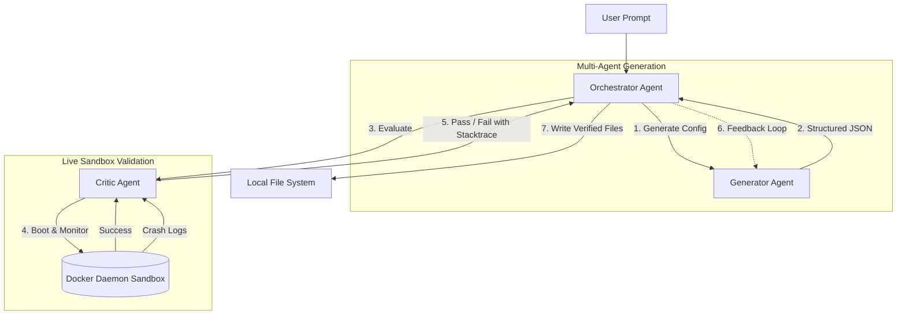

# LLM-Orchestrated Dev Environment Automation


An intelligent CLI tool that generates complete, production-ready, and containerized development environments from natural language prompts using Agentic Self-Healing Infrastructure-as-Code.

## Why this exists

Instead of manually writing `docker-compose.yml`, `Dockerfile`, and `.devcontainer/devcontainer.json` files or prompting an LLM file-by-file, this tool:
1. **Plans the architecture** based on your prompt.
2. **Generates the entire file tree** atomically using structured JSON extraction.
3. **Live Sandbox Verification**: Boots the generated environment in a background temporary directory (`docker-compose up -d`), monitors it for 5 seconds to ensure no containers crash, and tears it down.
4. **Autonomous Self-Healing**: If a container crashes on boot, the Critic agent extracts the real runtime `docker logs`, feeds the stack trace back to the LLM, and forces it to fix its own `Dockerfile` or `docker-compose.yml` code before finalizing.

## Architecture



## Stack
- Python 3.11+
- Click & Rich for UI
- Pydantic & Instructor for structured extraction
- LiteLLM + Ollama (Llama 3.2 locally)

## How to use

```bash
# Set up virtual environment
python -m venv venv
source venv/bin/activate  # or venv\Scripts\activate on Windows
pip install -e .

# Run the tool
dev-env generate "A Node.js backend with a Postgres database and Redis cache, including VS Code devcontainer setup"
```
